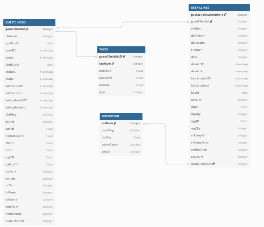

# Processo seletivo CB

Este repositório contém a solução para o desafio de engenharia de dados do CB.

## Modelo de Banco de Dados (MER)

Acompanhe o progresso e as tarefas do projeto no quadro Kanban:
[Acessar Quadro Kanban](https://github.com/joaocabeca2/projects/1) 

Abaixo está o Modelo de Entidade-Relacionamento do banco de dados:



# Desafio 1:
Fiquei com uma dúvida, pois no pdf vocês afirmam que : "Este exemplo corresponde a um determinado pedido (guestCheckId) com um único item  
(guestCheckLineItemId), referente a um único item de menu (menuItem)". Isso sugere que a relação 1:N apenas poderá ocorrer apenas
entre "DETAILLINES" e "MENUITEM". Para ajudar na tomada de decisão, eu assumia a lógica que a estrutura do ERP.json me forneceu. Bom ,
eu notei uma estrutura de listas que sugere que, para cada pedido, tem a possibilidade de haver mais
mais de uma ocorrência de "DETAILLINES" e "TAXES", ou seja uma relação de 1:N entre "GUESTCHECKS" e "DETAILLINES" e "GUESTCHECKS" e "TAXES".

Com isso, decidi criar quatro tabelas, "GUESTCHECKS", "TAXES", "DETAILINES" e "MENUITEM". Eu assumi
que "GUESTCHECKS" teria uma relação de 1:N com "TAXES" e "DETAILINES" e , esta, teria uma relação 1:N com "MENUITEM". No caso,
Um item de menu do catálogo (MENUITEMS) pode aparecer em muitas linhas de detalhe (DETAILLINES) em diferentes pedidos. Cada linha de detalhe
referencia um único item de menu do catálogo. 

Comecei criando um MER, pois acredito que seja uma boa prática. Por mais que vocês já tenham um banco de dados criado. é uma forma
de mostrar aos interessados como será a estrutura do banco, bem como seu funcionamento. E se tiver alguma ideia de ajuste, podemos
mudar tranquilarmente já que o banco não foi criado. Enfim, não faz muito sentido para esse caso, mas achei que seria um implemento
legal para esse processo seletivo.

Após isso, as tabelas foram criadas. Não há muitos comandos complexos nessa parte. Basicamente, vai ser decidido o tipo de dado para cada campo
e será organizada as chaves primárias e estrangeiras em cada tabela de forma que respeite o tipo de relação entre elas. Utilizei o sqlite pela facilidade
e não precisar de servidor. Foi criado uma linha para cada tabela.

# Desafio 2:

# 1. Por que armazenar as respostas das APIs?

As respostas brutas da API representam a informação original e inalterada da fonte. Armazená-las garante que haja sempre uma cópia fiel dos dados. Pode servir
como backup e tambem, caso haja mudança nos modelos de trabalho da empresa você pode fazer processamento de dados sem que haja a necessidade de chamar, novamente,
a API de origem.

# 2.Como você armazenaria os dados? Crie uma estrutura de pastas capaz de armazenar as respostas da API. 
Ela deve permitir manipulação, verificações, buscas e pesquisas rápidas.

```text
/data_lake/
├── raw/
│   ├── bi_getFiscalInvoice/
│   │   ├── year=YYYY/
│   │   │   ├── month=MM/
│   │   │   │   ├── day=DD/
│   │   │   │   │   ├── store_id=XXXX/
│   │   │   │   │   │   ├── {timestamp_uuid}.json  (Ex: 2024-07-26T10-30-00_uuid.json)
│   │   │   │   │   │   ├── ...
│   ├── res_getGuestChecks/
│   │   ├── year=YYYY/
│   │   │   ├── month=MM/
│   │   │   │   ├── day=DD/
│   │   │   │   │   ├── store_id=XXXX/
│   │   │   │   │   │   ├── {timestamp_uuid}.json
│   │   │   │   │   │   ├── ...
│   ├── org_getChargeBack/
│   │   ├── year=YYYY/
│   │   │   ├── month=MM/
│   │   │   │   ├── day=DD/
│   │   │   │   │   ├── store_id=XXXX/
│   │   │   │   │   │   ├── {timestamp_uuid}.json
│   │   │   │   │   │   ├── ...
│   ├── trans_getTransactions/
│   │   ├── year=YYYY/
│   │   │   ├── month=MM/
│   │   │   │   ├── day=DD/
│   │   │   │   │   ├── store_id=XXXX/
│   │   │   │   │   │   ├── {timestamp_uuid}.json
│   │   │   │   │   │   ├── ...
│   └── inv_getCashManagementDetails/
│       ├── year=YYYY/
│       │   ├── month=MM/
│       │   │   ├── day=DD/
│       │   │   │   ├── store_id=XXXX/
│       │   │   │   │   ├── {timestamp_uuid}.json
│       │   │   │   │   ├── ...
```


# 3. Considere que a resposta do endpoint getGuestChecks foi alterada, por exemplo, guestChecks.taxes foi renomeado para guestChecks.taxation. O que isso implicaria?

Qualquer código ou ferramenta que parseia o JSON da resposta da API e espera o campo "taxes" falharia. Acredito que a solução para esse caso, seria uma espécie
de mudança gradual. Com isso, criaria um novo endpoint "taxation", mas deixaria "taxes" funcionando, contudo com um comunicado para a empresa de que as novas
aplicações deveriam começar a utilizar "taxation" em vez de "taxes" e que o mesmo seria excluído depois de um certo período.


